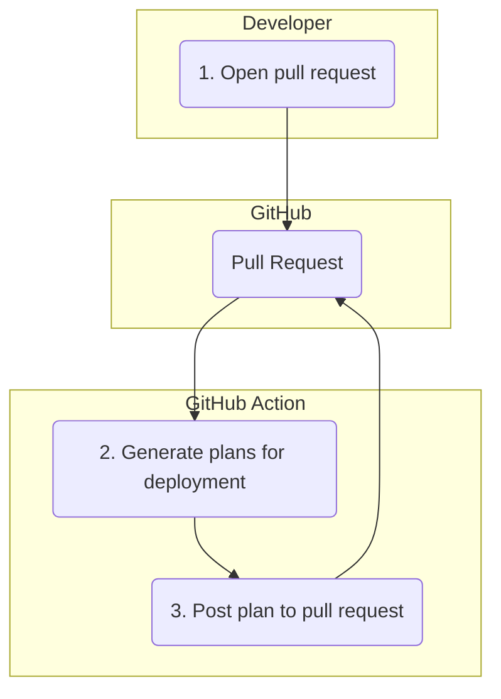
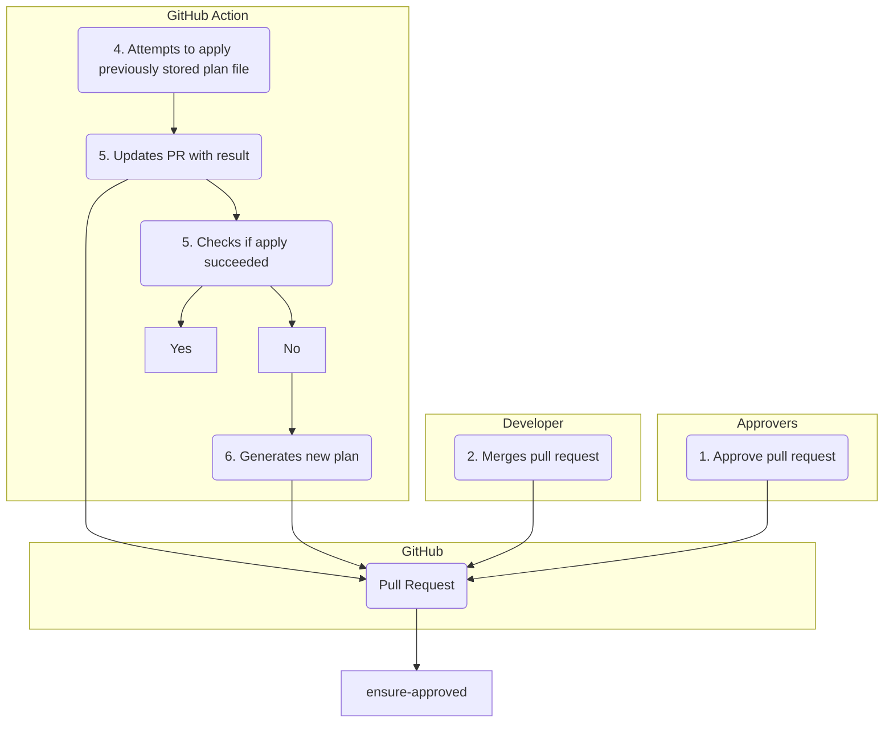

# Using Terragrunt for Repeatable Overlay Style Deployments

[Terragrunt](https://terragrunt.gruntwork.io) is a tool used to help make repeatable deployments
with Terraform in a DRY fashion. This repository contains a re-usable Action designed to help use
Terragrunt in the GitHub Actions context. Specifically, it aims to implement the following
requirements:

* Provide visibility into the status of a particular execution of Terragrunt by way of sticky pull
  request comments.
* Provide a mechanism for ensuring that the Action only uses a previously reviewed plan when
  applying a deployment.

<!-- action-docs-inputs -->
<!-- action-docs-inputs -->

## Permissions

Generally, the default permissions associated with the default GitHub token should work
fine. However, if you use this in a security-conscious GitHub organization where those default
permissions are reduced, you must provide, at a minimum, the following:

```
issues: write
pull_requests: write
contents: read
```

## Workflow

This Action implements the following workflow.

### Generate Plan Stage

* A developer opens a pull request that contains changes to infrastructure code.
* The Action generates a Terraform plan for the specified directory and posts the results to the
  pull request as a comment. If any `terragrunt plan` execution causes an error, the Action also
  publishes that to the pull request.



### Apply Stage

* One or more approvers review the changed code, attached Terraform plans, and approve the pull
  request.
* The developer merges the pull request and the Action triggered by the commit. The Action looks up
  the PR that the merge came from, locates the plan for the particular directory under which
  Terragrunt is executing, and ensures that the plan newly generated matches the existing one. The
  Action uses a hashing of the JSON output of the plan, as plan files often contain sensitive
  information. If the plans match, the Action applies the plan; if not, it throws an error telling
  the user that the plan is stale.

**Apply with Merge**


## Roadmap

**Feature Implementation**
- [X] Generate Terraform plan and post back to pull request as a sticky comment
- [ ] Ensure only plans that have been reviewed are used when applying changes
