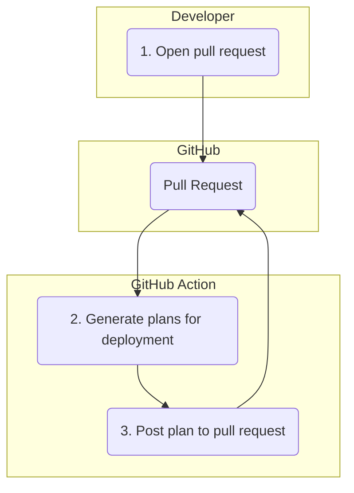
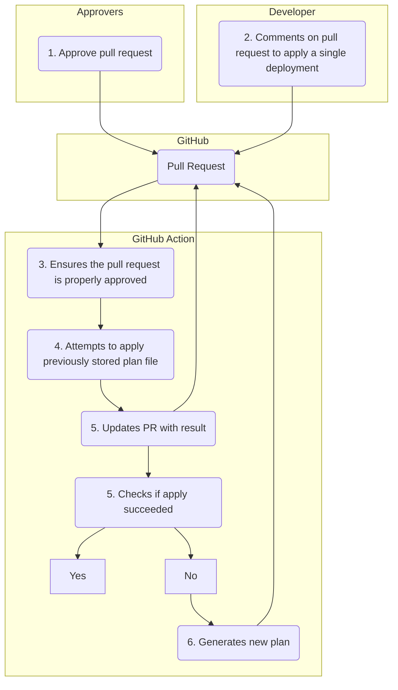

# Using Terragrunt for Repeatable Overlay Style Deployments

[Terragrunt](https://terragrunt.gruntwork.io) is a tool used to help make repeatable deployments
with Terraform in a DRY fashion. This repository contains a re-usable Action designed to help make
using Terragrunt in the context of GitHub Actions easy. Specifically, it
aims to implement the following requirements:

* Provide visibility into the status of a particular execution of Terragrunt by way of sticky pull
  request comments.
* Provide a mechanism for ensuring that only a plan that was previously reviewed is used when
  applying a deployment.
* Allow for the applying of infrastructure changes using a ChatOps style interface, such that
  changes can be applied while the pull request is still open (helping to prevent the classic "fail
  on apply -> `main` broken problem), while still ensuring GitHub's native approval mechanisms are enforced.

## Workflow

The workflow this Action seeks to implement can be visualized in the following stages.

### Generate Plan Stage

* A developer opens a pull request that contains changes to infrastructure code.
* The Action builds a tree of changed deployments and any of their dependents,      using
  Terragrunt's built in dependency framework and the
  [`graph-dependencies`](https://terragrunt.gruntwork.io/docs/reference/cli-options/#graph-dependencies)
  CLI option.
* The Action generates a Terraform plan for each of these deployments and posts the results back to
  the pull request as a comment. In addition, the plan binary file is stored as a build artifact,
  with the pull request comment containing the link to the artifact. If any plan generates and
  error, that is posted to the pull request as well.

### Apply Stage

* One or more approvers review the changed code and attached Terraform plans and approves the pull request.
* A developer comments on the pull request, asking that a particular deployment be applied (using a
  given ChatOps style syntax).
* The Action ensures that the pull request is in a properly approved state using the GitHub API.
  (This ensures that we use GitHub's own definition of what is "properly approved" based on internal
  rules like branch protection policies).
* The Action retrieves the stored binary plan file and attempts to apply it. The result of this
  apply is used to update the pull request comment created in the step that generates plans (to
  avoid long strings of comments in the pull request). If the apply fails, a new plan is generated
  automatically and the comment updated to match.

