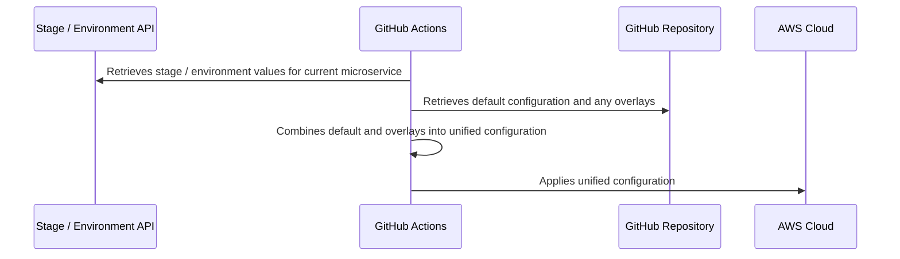

# Using Terragrunt for Repeatable Overlay Style Deployments

[Terragrunt](https://terragrunt.gruntwork.io) is a tool used to help make repeatable deployments
with Terraform in a DRY fashion. This repository contains a re-usable Action designed to help make
this even more useful in the context of large, diverse, distributed environments. Specifically, it
aims to implement the following requirements:

* Introduce the concept of a _default_ configuration, which defines the values passed to the
  underlying Terraform deployment _unless an overlay / override is explicitly provided_.
* Codify a standard two layer hierarchical organization framework for how infrastructure is typically
  deployed:
  
  * **Stage:** This is the functional use of the infrastructure, typically described by words like
    `development`, `integration`, `staging`, and `production`.
  * **Environment:** This is the location of the infrastructure, usually the AWS region name.

  >**Note:** These concepts are largely based on the tenets set forth by the
  >[CloudPosse](https://github.com/cloudposse) organization, specifically the labels described in
  >their [terraform-null-label](https://github.com/cloudposse/terraform-null-label) module.
* Delegate the injection of the stage and environment values to the CICD pipeline itself, rather
  than requiring the use of Terragrunt files that are largely duplicates of each other (with the
  exception of environment and stage names).

## Example

This section describes a complete example of how this Action and design pattern makes the deployment
of large, distributed environments more maintainable.

Consider the following situation: within your organization, you have one hundred different
microservices, each of which is stored in its own GitHub repository. Along side the application
code sits the Terragrunt files that define the infrastructure required to run the application. You
are following Terragrunt's recommended design patterns, such as the use of [immutable, versioned
Terraform
modules](https://terragrunt.gruntwork.io/docs/getting-started/quick-start/#promote-immutable-versioned-terraform-modules-across-environments).
Each stage is deployed in a different AWS Account, following the best practice of segmentation and
blast radius limitation defined in the [Security pillar of the AWS Well Architected Framework](https://docs.aws.amazon.com/wellarchitected/latest/security-pillar/aws-account-management-and-separation.html).

### How we do it now

The typical way to lay out the Terragrunt files in the service repository might look like this:

```
|-- infrastructure/
|   |-- development/
|   |   |-- terragrunt.hcl 
|   |   |-- us-east-1/
|   |   |   |-- s3/
|   |   |   |   |-- terragrunt.hcl
|   |   |   |-- database/
|   |   |   |   |-- terragrunt.hcl
|   |   |-- us-east-2/
|   |   |   |-- s3/
|   |   |   |   |-- terragrunt.hcl
|   |   |   |-- database/
|   |   |   |   |-- terragrunt.hcl
|   |-- staging/ # defines configurations common across all staging deployments
|   |   |-- terragrunt.hcl 
|   |   |-- us-east-1/
|   |   |   |-- s3/
|   |   |   |   |-- terragrunt.hcl
|   |   |   |-- database/
|   |   |   |   |-- terragrunt.hcl
|   |   |-- us-east-2/
|   |   |   |-- s3/
|   |   |   |   |-- terragrunt.hcl
|   |   |   |-- database/
|   |   |   |   |-- terragrunt.hcl
|   |-- production/ # defines configurations common across all production deployments
|   |   |-- terragrunt.hcl 
|   |   |-- us-east-1/
|   |   |   |-- s3/
|   |   |   |   |-- terragrunt.hcl
|   |   |   |-- database/
|   |   |   |   |-- terragrunt.hcl
|   |   |-- us-east-2/
|   |   |   |-- s3/
|   |   |   |   |-- terragrunt.hcl
|   |   |   |-- database/
|   |   |   |   |-- terragrunt.hcl
|   |   |-- us-west-2/
|   |   |   |-- s3/
|   |   |   |   |-- terragrunt.hcl
|   |   |   |-- database/
|   |   |   |   |-- terragrunt.hcl
```

One day, business comes along and requires that you create two brand new regions in Europe,
specifically in the EU-West-1 and EU-Central-1 AWS regions. These environments should mirror the
US-East-1 and US-East-2 regions respectively.

To accomplish this, you would need to go to each of those ~100 repositories and add a set of files
looking something like this:

```
|   |   |-- eu-west-1/
|   |   |   |-- s3/
|   |   |   |   |-- terragrunt.hcl
|   |   |   |-- database/
|   |   |   |   |-- terragrunt.hcl
|   |   |-- eu-central-1/
|   |   |   |-- s3/
|   |   |   |   |-- terragrunt.hcl
|   |   |   |-- database/
|   |   |   |   |-- terragrunt.hcl
```

The pull requests for these files would then need to be reviewed and individually merged. That's a
lot of work!

### Imagine a better way

Let's consider instead a different approach. Instead of maintaining individual files and folder for
each stage and environment, we instead have the concept of a _default_ configuration, which is used,
well, by default! In other words, unless we specifically indicate we want to override the default
values, our system will use the defaults when deploying to any stage or environment, and it's the
deployment pipeline itself that is responsible for knowing what stages and environments exist.

The folder structure is much simpler in this way, because in many cases the values for the different
configurations don't vary.

```
|-- infrastructure/
|   |-- default/
|   |   |-- terragrunt.hcl # Defines common things like state file paths
|   |   |-- s3/
|   |   |   |-- terragrunt.hcl
|   |   |-- database/
|   |   |   |-- terragrunt.hcl
|   |-- production/
|   |   |-- terragrunt.hcl # Production specific overrides
|   |   |-- us-east-1/
|   |   |   |-- database/
|   |   |   |   |-- terragrunt.hcl # Different scale levels for database
|   |   |-- us-east-2/
|   |   |   |-- database/
|   |   |   |   |-- terragrunt.hcl
|   |   |-- us-west-2/
|   |   |   |-- database/
|   |   |   |   |-- terragrunt.hcl
```

As you can see, the only places where additional files are required are in cases where values differ
(something that's probably more common in production stages).

In addition, when you need to provision a new stage or environment, all you need to do is tell the
deployment pipeline it's required, and then run the deployment across all your microservices. New
infrstructure will get deployed with the default values, no pull requestes required.

## Goals of the project

This project aims to provide a way to implement the above described pattern _from the point of
combining the default and overlay values forward_. To be more specific, here's a diagram of the various components of the solution.



This project aims to provide a solution from the second step forward, while also providing a
(hopefully fairly) extensible way to interact with whatever component handles the first step of
retrieving the stage and environment values. Because the logic and implementation details for this
first step might vary extensively depending upon things specific to your implementation, I did not
want to restrict or otherwise prescribe the manner in which this was done.

## Reference Implementation

A reference implementation of this solution might look like this.

* An organization creates a [re-usable GitHub Actions
  Workflow](https://docs.github.com/en/actions/using-workflows/reusing-workflows) that does the
  following:
  * Calls a proprietary API or other system, passing in the current microservice name, and expecting
    back an array of objects looking something like this:
    ```json
    {
      "stages": [
        "development": {
          "environments": [
            "us-east-1": {
              "includes": [],
              "extraValues": {} 
            },
            "us-east-2": {
              "includes": [],
              "extraValues": {} 
            }
          ]
        },
        "staging": {
          "environments": [
            "us-east-1": {
              "includes": [],
              "extraValues": {} 
            },
            "us-east-2": {
              "includes": [],
              "extraValues": {} 
            }
          ]
        },
        "production": {
          "environments": [
            "us-east-1": {
              "includes": [],
              "extraValues": {} 
            },
            "us-east-2": {
              "includes": [],
              "extraValues": {} 
            },
            "us-west-2": {
              "includes": [],
              "extraValues": {} 
            },
          ]
        },
      ]
    }
    ```
  * Calls a [matrix](https://docs.github.com/en/actions/using-jobs/using-a-matrix-for-your-jobs)
    with each item being a combination of a stage and an environment. The job checks out the source
    code, assumes an AWS IAM Role, and calls the Action provided by this project, passing in the
    `environment` object from the above API result. 
    
    **Note:** Ideally you'd do this for one Stage at a time, likely triggered by different things.
    For example, you might deploy to the `development` stage on every merge to `main`, the `staging`
    stage on a pre-release, and `production` on a release being finalized.